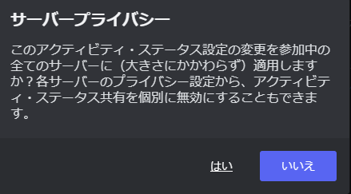

# SaoT (Spotify activity on Twitter)

Spotifyで再生中の曲を自動的にTwitterに投稿するDiscordBotですが、別ブランチでfoobar2000に対応した奴作りました。  
Spotifyバージョンは[こっち](https://github.com/MotiCAT/SaoT/tree/master)

## 機能

- Discordのステータスを利用して、foobar2000で再生中の曲を取得し、自動的にTwitterに投稿します。

## ライセンス
[MIT](LICENSE)

## 貢献ガイドライン

現在、このプロジェクトは基本的な機能を持っており、新機能の追加やバグ報告の必要はありません。しかし、コードの改善やリファクタリングの提案は歓迎します。その場合は、GitHubのプルリクエストを通じて貢献してください。

## セットアップ

### 必要なツール

- Node.js: このプロジェクトはNode.jsで開発されています。最新の安定版をインストールしてください。
- npm: パッケージ管理にはnpmを使用しています。Node.jsをインストールすると一緒にインストールされます。

### Discord BotとTwitter APIの設定

Discord Botのトークンの取得やTwitterのAPIキーの取得方法については、各自で調査して設定を行ってください。

### 設定ファイルの準備

このプロジェクトには`.env.example`という名前の設定ファイルが含まれています。このファイルは、実際の設定ファイル`.env`のテンプレートとして機能します。

まず、`.env.example`ファイルの名前を`.env`に変更します。次に、`.env`ファイル内の以下の項目を適切に設定します：
```env
API_KEY=
API_SECRET=
ACCESS_TOKEN=
ACCESS_TOKEN_SECRET=
```

上記4項目には、それぞれ対応するTwitterのAPIキーを設定します。

```env
USER_ID=
DISCORD_TOKEN=
```

`USER_ID`には、Discordで使用している自身のユーザーIDを、`DISCORD_TOKEN`にはDiscord Botのトークンを設定してください。

### 依存関係のインストール

プロジェクトのルートディレクトリで以下のコマンドを実行して、必要な依存関係をインストールします。

```bash
npm install
```

## foobar2000とDiscordの設定

- foobar2000  
  [こちら](https://note.com/shirafuka_yayoi/n/n92af2e5c4673)の記事を参考に、**Discord Rich Presence Integration**を導入してください。  
- Discord  
  Discordの設定メニューから、「アクティビティ設定」の「**現在のアクティビティをステータスに表示する**」と「**大きなサーバーに参加するとき、デフォルトでアクティビティ・ステータスを共有します。**」を有効にしてください。  
  「**大きなサーバーに参加するとき、デフォルトでアクティビティ・ステータスを共有します。**」に関しては有効にしたときに下記のような確認画面が出ますが、「はい」を押してください。  
    
- Discord Bot  
  Discordの開発者ポータルからBotの設定ページに移動し、「**PRESENCE INTENT**」を有効にしてください。これをONにしないと起動が不可能です。

## 注意事項

このBotは、自分のサーバーに導入されている場合のみ機能します。  
**自分のアカウントがオフライン表示でないこと、および自分のサーバーにBotが存在すること**を確認してから使用してください。  

Discord Rich Presence Integrationの仕様上、Activityをカスタマイズすることができますが、このBotを使用する場合 Activityのタイトルに「**foobar2000**」が含まれていることが前提となっています。  
また、曲名やアップロード者の名前も特定のフィールドから取得しているため、変更すると正常にツイートされない可能性があります。  
タイトル以外のカスタマイズは控えるようにお願いいたします。

## プロジェクトの実行

プロジェクトを実行する前に、以下の準備作業を確認してください。

1. すべての依存関係がインストールされていること。依存関係のインストールは、プロジェクトのルートディレクトリで`npm install`コマンドを実行することで行えます。

2. `.env`設定ファイルが適切に設定されていること。設定ファイルの準備については、上記の「設定ファイルの準備」セクションを参照してください。

これらの準備が整ったら、以下のコマンドを実行してプロジェクトを起動します。

```bash
npm run start
```